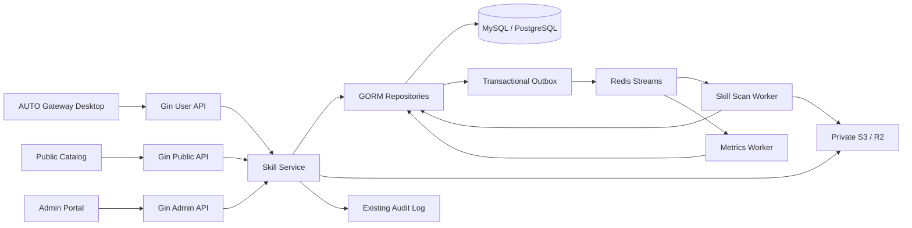
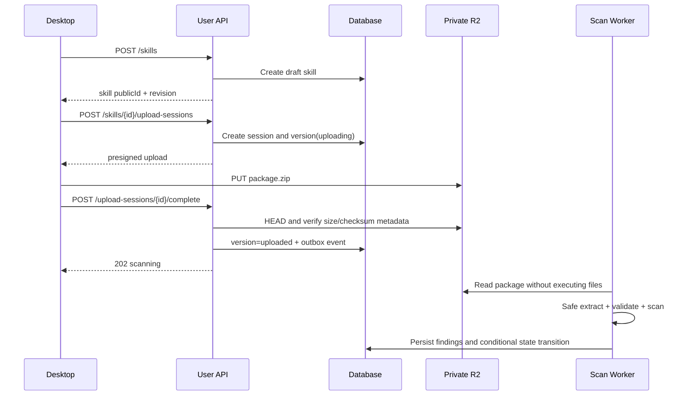
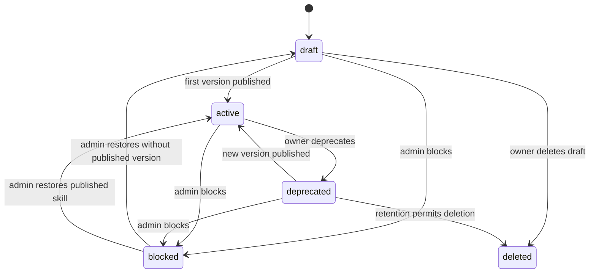
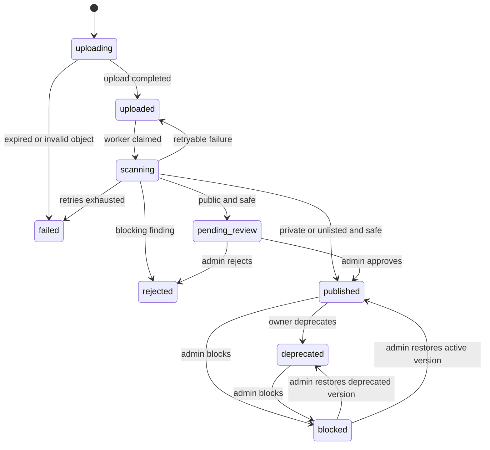

# Codex 技能分发服务架构

## 1. 架构目标

服务需要同时满足四类约束：

1. 上传内容不可信，任何预览、扫描或发布流程都不能执行包内代码。
2. 版本发布后内容不可变，下载结果必须能用 SHA-256 验证。
3. 数据库状态与异步任务不能因进程崩溃而永久失步。
4. private、unlisted、public 三种可见性使用同一套授权和审计模型。

## 2. 逻辑架构



### 2.1 信任边界

| 边界 | 规则 |
| --- | --- |
| 客户端 → API | 不信任名称、版本、哈希、文件大小和设备 ID；服务端重新校验 |
| API → 对象存储 | 只允许服务端生成 object key；客户端不能指定 bucket 或 key |
| 对象存储 → 扫描器 | 对象仍是不可信输入；校验 checksum、压缩格式、路径和资源上限 |
| 扫描器 → 数据库 | 扫描结果带 `scannerVersion`，状态更新使用条件更新防止旧任务覆盖新状态 |
| API → 下载 URL | 授权在签名 URL 生成前完成；URL 短时有效且不写入业务日志 |

## 3. 领域边界

| 领域 | 职责 | 不负责 |
| --- | --- | --- |
| Catalog | 技能元数据、分类、标签、公开搜索 | 包上传和本地安装 |
| Versioning | 版本、manifest、校验值、发布状态 | 修改已发布内容 |
| Distribution | 分享、访问授权、下载许可 | 组织成员目录 |
| Installation | 接收设备侧安装状态和统计 | 操作本机文件系统 |
| Governance | 扫描、审核、封禁、审计 | 执行 Skill 脚本 |

## 4. 服务模块

### 4.1 HTTP 层

在现有路由域中注册：

- `/public/api/skills`：公开目录、分类、分享解析和公开下载许可。
- `/user/api/skills`：创建、更新、上传、版本、分享、授权和安装状态；复用用户 Session 与 Console API permission。
- `/admin/api/skills`：审核、封禁、恢复、分类管理和审计查询；复用 Admin auth。

Handler 必须做到：解析 DTO、调用中间件、调用 Service、映射统一错误。Handler 不直接拼 GORM 查询，也不直接改变发布状态。

### 4.2 `skillservice`

Service 是业务状态的唯一写入口，至少提供：

- `CreateSkill`
- `UpdateSkillMetadata`
- `CreateUploadSession`
- `CompleteUploadSession`
- `ApplyScanResult`
- `ReviewVersion`
- `CreateShareLink`
- `AuthorizeDownload`
- `ReportInstallation`
- `BlockSkill`

每个写方法都接收 actor、request ID 和 idempotency key；需要审计的操作在同一业务调用中写审计记录。

### 4.3 Repository

Repository 将领域对象与 GORM model 分离，负责：

- ownership/visibility 条件查询；
- cursor 分页；
- `revision` 乐观锁；
- 状态条件更新；
- 跨表事务；
- Outbox 写入与领取。

不要把 API JSON DTO 直接作为 GORM model，以免接口兼容性和数据库迁移互相绑定。

### 4.4 Object Store

新增 Skill package store 接口：

```go
type SkillPackageStore interface {
    CreateUploadURL(ctx context.Context, objectKey string, size int64, sha256 string, expiresAt time.Time) (PresignedUpload, error)
    HeadObject(ctx context.Context, objectKey string) (ObjectInfo, error)
    OpenObject(ctx context.Context, objectKey string) (io.ReadCloser, error)
    PutManifest(ctx context.Context, objectKey string, body []byte, sha256 string) error
    CreateDownloadURL(ctx context.Context, objectKey string, expiresAt time.Time) (string, error)
    DeleteObject(ctx context.Context, objectKey string) error
}
```

接口名和日志使用英文；实现可复用现有 AWS SDK v2/R2 配置方式，但 Skill bucket/prefix 与工单附件隔离。

## 5. 核心流程

### 5.1 创建、上传和扫描



扫描安全通过后：

- `private`/`unlisted`：Worker 将版本设为 `published`。
- `public`：Worker 将版本设为 `pending_review`，管理员审核后设为 `published`。
- 阻断项：版本设为 `rejected`；技术性故障在重试耗尽后设为 `failed`。

### 5.2 下载和安装回传

1. 客户端请求版本下载许可。
2. Service 按 ownership、grant、share token 或 public visibility 判定权限。
3. API 返回 5 分钟有效的对象 URL、SHA-256、包大小和 manifest 摘要。
4. 客户端下载后校验 SHA-256，并完成本地安全安装。
5. 客户端用 `PUT /user/api/skill-installations/{skillId}` 回传版本、设备伪名和启用状态。
6. 服务端 upsert 安装快照，并异步聚合统计。

下载 URL 的签发不代表安装成功；下载次数和安装数必须作为两个指标。

### 5.3 分享

- 创建分享时生成至少 256 bit 随机 token，仅返回一次明文；数据库只保存 SHA-256。
- 分享可固定到某个版本，也可跟随 `latestPublishedVersionId`。
- 浏览器链接将 token 放在 URL fragment 中，由页面通过 POST body 解析，避免 token 出现在反向代理访问日志。
- 撤销、到期或达到 `maxUses` 后，新的下载许可立即失败；已签发 URL 最多继续有效到短 TTL 结束。

## 6. 状态机

### 6.1 Skill 生命周期



`deleted` 使用软删除；存在已发布版本或安装记录时，普通用户操作优先使用 `deprecated`，避免破坏历史引用。

### 6.2 Version 生命周期



状态迁移必须使用 `WHERE id = ? AND status = ?` 条件更新。任何非图示迁移返回 `SKILL_INVALID_STATE_TRANSITION`。

## 7. 一致性和故障恢复

- 创建版本、完成上传、写 Outbox 在同一个数据库事务中。
- Outbox publisher 使用 `FOR UPDATE SKIP LOCKED`（PostgreSQL/MySQL 8）或等效租约领取事件。
- Worker 消息至少投递一次；扫描和统计 consumer 必须幂等。
- `scanAttempt` 和 `scannerVersion` 随结果保存，旧 attempt 不能覆盖新结果。
- 对象删除采用延迟清理：先把数据库对象标为不可引用，至少 7 天后再物理删除。
- Redis 不可用时，HTTP 创建和上传完成仍可落库；Outbox publisher 恢复后补发。
- 对象存储不可用时，不生成假 URL，返回可重试的 `503 SKILL_STORAGE_UNAVAILABLE`。

## 8. 配置建议

建议新增配置，不复用工单附件的 bucket/prefix：

```yaml
skills:
  enabled: false
  storage:
    endpoint: ""
    accessKeyId: ""
    secretAccessKey: ""
    bucket: ""
    region: "auto"
    prefix: "skills"
  limits:
    archiveBytes: 26214400
    unpackedBytes: 104857600
    fileCount: 2000
    pathDepth: 16
  uploadUrlTtlSeconds: 900
  downloadUrlTtlSeconds: 300
  scannerConcurrency: 4
```

生产环境必须从 secret manager 注入凭据，配置和日志不得输出 secret、分享 token、签名 URL 或包内容。

## 9. 团队分发扩展

当前服务没有 workspace/team membership 的可靠领域模型，因此 MVP 只支持 owner、用户授权、分享链接和 public catalog。Phase 2 在统一组织域落地后增加：

- `skill_workspace_grants`；
- `available`、`recommended`、`required` 安装策略；
- workspace admin 审批和审计；
- 桌面端策略同步。

团队策略不能仅由客户端声明，成员身份和角色必须由服务端组织域判定。
