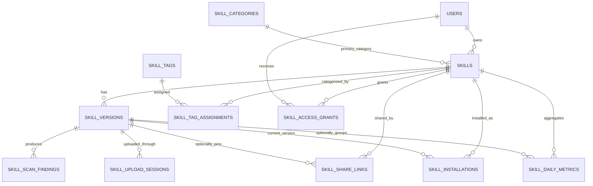

# Codex 技能分发服务数据库设计

## 1. 设计原则

- 关系数据库只保存可查询元数据、授权、状态和审计；ZIP、manifest 原文存对象存储。
- 内部主键使用 `BIGINT`，外部接口只暴露不可枚举的 `public_id`。
- 已发布版本不可变，更新内容必须新增 `skill_versions` 记录。
- 所有时间由服务端生成并以 UTC 存储，API 输出 RFC 3339。
- JSON 只用于低频扩展字段；需要筛选、排序、唯一性或外键的数据必须独立成列。
- MVP 同时兼容 MySQL 8 和 PostgreSQL 15+，不依赖单一数据库的专有枚举类型。

## 2. ER 模型

`USERS` 和 `AUDIT_LOGS` 复用现有表，不在本功能重复定义。

## 3. 字段约定

| 名称 | 建议类型 | 约定 |
| --- | --- | --- |
| `id` | `BIGINT` | 自增内部主键，不通过外部 API 返回 |
| `public_id` | `VARCHAR(64)` | 可带资源前缀的 UUID/ULID 等不透明 ID，唯一且创建后不变 |
| `metadata` | `JSON` | 可空，禁止放入需要查询的核心状态 |
| `created_at` | `TIMESTAMP(6)` | UTC |
| `updated_at` | `TIMESTAMP(6)` | UTC |
| `deleted_at` | `TIMESTAMP(6)` | 可空，软删除 |
| `revision` | `BIGINT` | 从 1 开始的乐观锁版本 |
| `*_sha256` | `CHAR(64)` | 小写十六进制 |

Go model 沿用现有 `BaseModelFields` / `AppendOnlyModelFields`，但迁移必须显式创建本文要求的唯一索引和复合索引。

## 4. 核心表

### 4.1 `skills`

技能的稳定身份和可编辑元数据。

| 字段 | 类型 | Null | 默认值 | 说明 |
| --- | --- | --- | --- | --- |
| `id` | `BIGINT` | No | auto | 内部主键 |
| `public_id` | `VARCHAR(64)` | No | — | 外部 ID |
| `owner_user_id` | `BIGINT` | No | — | 所有者，引用 `users.id` |
| `slug` | `VARCHAR(64)` | No | — | 所有者范围内稳定别名 |
| `name` | `VARCHAR(64)` | No | — | `SKILL.md` 机器名，`^[a-z0-9-]+$` |
| `display_name` | `VARCHAR(128)` | No | — | 展示名 |
| `description` | `VARCHAR(1024)` | No | — | 简介 |
| `visibility` | `VARCHAR(16)` | No | `private` | `private`、`unlisted`、`public` |
| `status` | `VARCHAR(16)` | No | `draft` | `draft`、`active`、`deprecated`、`blocked` |
| `primary_category_id` | `BIGINT` | Yes | null | 主分类 |
| `latest_published_version_id` | `BIGINT` | Yes | null | 最新可安装版本 |
| `revision` | `BIGINT` | No | 1 | 元数据乐观锁 |
| `download_count` | `BIGINT` | No | 0 | 最终一致的累计下载数 |
| `install_count` | `BIGINT` | No | 0 | 最终一致的累计首次安装数 |
| `metadata` | `JSON` | Yes | null | 低频扩展字段 |
| `created_at` | `TIMESTAMP(6)` | No | now | 创建时间 |
| `updated_at` | `TIMESTAMP(6)` | No | now | 更新时间 |
| `deleted_at` | `TIMESTAMP(6)` | Yes | null | 软删除时间 |

索引：

- `UNIQUE(public_id)`
- `UNIQUE(owner_user_id, slug)`：删除后仍保留 slug，避免旧链接指向新内容。
- `INDEX(owner_user_id, status, updated_at, id)`
- `INDEX(visibility, status, updated_at, id)`
- `INDEX(primary_category_id, visibility, status, updated_at, id)`
- `INDEX(latest_published_version_id)`

`name` 来自包内 manifest；创建 draft 时可先使用用户输入，首次扫描通过后必须与 manifest 对齐。若名称变化，应创建新 Skill，不能通过新版本悄悄改变机器名。

### 4.2 `skill_versions`

不可变版本和发布状态。

| 字段 | 类型 | Null | 默认值 | 说明 |
| --- | --- | --- | --- | --- |
| `id` | `BIGINT` | No | auto | 内部主键 |
| `public_id` | `VARCHAR(64)` | No | — | 外部版本 ID |
| `skill_id` | `BIGINT` | No | — | 所属 Skill |
| `version` | `VARCHAR(32)` | No | — | 规范化 SemVer，不带前缀 `v` |
| `status` | `VARCHAR(24)` | No | `uploading` | 版本状态机 |
| `archive_object_key` | `VARCHAR(512)` | Yes | null | 私有对象 key |
| `archive_sha256` | `CHAR(64)` | Yes | null | 实际包摘要 |
| `archive_size` | `BIGINT` | Yes | null | 压缩包字节数 |
| `file_count` | `INTEGER` | Yes | null | 解包后文件数 |
| `unpacked_size` | `BIGINT` | Yes | null | 解包后总字节数 |
| `manifest_object_key` | `VARCHAR(512)` | Yes | null | 规范化 manifest 对象 key |
| `manifest_sha256` | `CHAR(64)` | Yes | null | manifest 摘要 |
| `changelog` | `TEXT` | Yes | null | 版本说明 |
| `min_codex_version` | `VARCHAR(32)` | Yes | null | 最低兼容版本，TBD |
| `scanner_version` | `VARCHAR(64)` | Yes | null | 扫描规则版本 |
| `scan_attempt` | `INTEGER` | No | 0 | 当前有效扫描 attempt |
| `scan_risk` | `VARCHAR(16)` | Yes | null | `none`、`low`、`medium`、`high`、`blocked` |
| `scan_summary` | `JSON` | Yes | null | 计数与非敏感摘要 |
| `submitted_at` | `TIMESTAMP(6)` | Yes | null | 进入扫描时间 |
| `reviewed_at` | `TIMESTAMP(6)` | Yes | null | 人审时间 |
| `reviewed_by` | `VARCHAR(128)` | Yes | null | 审核 actor，与现有审计 actor 对齐 |
| `review_note` | `TEXT` | Yes | null | 驳回/批准说明 |
| `published_at` | `TIMESTAMP(6)` | Yes | null | 发布时间 |
| `deprecated_at` | `TIMESTAMP(6)` | Yes | null | 废弃时间 |
| `blocked_at` | `TIMESTAMP(6)` | Yes | null | 封禁时间 |
| `metadata` | `JSON` | Yes | null | 低频扩展字段 |
| `created_at` | `TIMESTAMP(6)` | No | now | 创建时间 |
| `updated_at` | `TIMESTAMP(6)` | No | now | 更新时间 |

索引：

- `UNIQUE(public_id)`
- `UNIQUE(skill_id, version)`
- `INDEX(skill_id, status, created_at, id)`
- `INDEX(status, submitted_at, id)`：审核/扫描队列查询。
- `INDEX(archive_sha256)`：内容去重和安全事件检索，不设置唯一。

发布后禁止更新 archive、manifest、version 和扫描结果。允许更新的只有 `status`、废弃/封禁时间及审核字段；内容修复必须发布新版本。

### 4.3 `skill_categories`

| 字段 | 类型 | Null | 说明 |
| --- | --- | --- | --- |
| `id` | `BIGINT` | No | 主键 |
| `public_id` | `VARCHAR(64)` | No | 外部 ID |
| `parent_id` | `BIGINT` | Yes | 父分类，MVP 最多两级 |
| `slug` | `VARCHAR(64)` | No | 稳定英文键 |
| `name_en` | `VARCHAR(128)` | No | 英文名称 |
| `name_zh_cn` | `VARCHAR(128)` | No | 简体中文名称 |
| `description_en` | `VARCHAR(512)` | Yes | 英文描述 |
| `description_zh_cn` | `VARCHAR(512)` | Yes | 简体中文描述 |
| `sort_order` | `INTEGER` | No | 排序值 |
| `enabled` | `BOOLEAN` | No | 是否可分配 |
| `created_at` / `updated_at` | `TIMESTAMP(6)` | No | 时间戳 |

索引：`UNIQUE(public_id)`、`UNIQUE(slug)`、`INDEX(parent_id, enabled, sort_order)`。分类禁用不会自动删除已有分配。

### 4.4 `skill_tags` 与 `skill_tag_assignments`

`skill_tags`：

| 字段 | 类型 | 约束 |
| --- | --- | --- |
| `id` | `BIGINT` | PK |
| `public_id` | `VARCHAR(64)` | UNIQUE |
| `slug` | `VARCHAR(64)` | UNIQUE，小写规范化 |
| `display_name` | `VARCHAR(128)` | NOT NULL |
| `enabled` | `BOOLEAN` | NOT NULL |
| `created_at` / `updated_at` | `TIMESTAMP(6)` | NOT NULL |

`skill_tag_assignments`：

| 字段 | 类型 | 约束 |
| --- | --- | --- |
| `skill_id` | `BIGINT` | NOT NULL |
| `tag_id` | `BIGINT` | NOT NULL |
| `created_at` | `TIMESTAMP(6)` | NOT NULL |

主键或唯一键为 `(skill_id, tag_id)`；额外索引 `(tag_id, skill_id)`。MVP 每个 Skill 最多 10 个标签。

## 5. 上传与扫描表

### 5.1 `skill_upload_sessions`

| 字段 | 类型 | Null | 说明 |
| --- | --- | --- | --- |
| `id` | `BIGINT` | No | 主键 |
| `public_id` | `VARCHAR(64)` | No | 外部 upload ID |
| `skill_id` | `BIGINT` | No | 目标 Skill |
| `skill_version_id` | `BIGINT` | No | 预创建版本 |
| `user_id` | `BIGINT` | No | 上传者 |
| `object_key` | `VARCHAR(512)` | No | staging object key |
| `expected_sha256` | `CHAR(64)` | No | 客户端声明摘要 |
| `expected_size` | `BIGINT` | No | 客户端声明大小 |
| `actual_size` | `BIGINT` | Yes | HEAD/scan 取得大小 |
| `object_etag` | `VARCHAR(128)` | Yes | 诊断用，不作为 SHA-256 |
| `status` | `VARCHAR(16)` | No | `created`、`uploaded`、`completed`、`expired`、`failed` |
| `idempotency_key_hash` | `CHAR(64)` | Yes | 请求幂等键摘要 |
| `expires_at` | `TIMESTAMP(6)` | No | 上传 URL 到期时间 |
| `completed_at` | `TIMESTAMP(6)` | Yes | 完成时间 |
| `created_at` / `updated_at` | `TIMESTAMP(6)` | No | 时间戳 |

索引：

- `UNIQUE(public_id)`
- `UNIQUE(user_id, idempotency_key_hash)`，空值处理需分别验证两种数据库。
- `UNIQUE(skill_version_id)`
- `INDEX(status, expires_at, id)`

ETag 在分段上传时不等于文件摘要；实际 SHA-256 由扫描 Worker 流式计算。

### 5.2 `skill_scan_findings`

| 字段 | 类型 | Null | 说明 |
| --- | --- | --- | --- |
| `id` | `BIGINT` | No | 主键 |
| `skill_version_id` | `BIGINT` | No | 版本 |
| `scan_attempt` | `INTEGER` | No | 扫描 attempt |
| `code` | `VARCHAR(64)` | No | 稳定规则码，例如 `ARCHIVE_PATH_TRAVERSAL` |
| `severity` | `VARCHAR(16)` | No | `info`、`low`、`medium`、`high`、`critical` |
| `relative_path` | `VARCHAR(512)` | Yes | 清洗后的相对路径 |
| `message` | `VARCHAR(1024)` | No | 开发者可读英文说明 |
| `blocking` | `BOOLEAN` | No | 是否阻断发布 |
| `details` | `JSON` | Yes | 不含文件原文和 secret 的详情 |
| `created_at` | `TIMESTAMP(6)` | No | 创建时间 |

索引：`INDEX(skill_version_id, scan_attempt, severity, id)`、`INDEX(code, created_at, id)`。同一版本每个 attempt 的 findings 在事务中整体替换或追加后切换有效 attempt。

### 5.3 `skill_outbox_events`

| 字段 | 类型 | Null | 说明 |
| --- | --- | --- | --- |
| `id` | `BIGINT` | No | 主键和顺序游标 |
| `event_type` | `VARCHAR(64)` | No | 如 `skill.version.scan.requested` |
| `aggregate_type` | `VARCHAR(32)` | No | `skillVersion` 等 |
| `aggregate_id` | `VARCHAR(64)` | No | 外部 aggregate ID |
| `payload` | `JSON` | No | 版本化消息体 |
| `status` | `VARCHAR(16)` | No | `pending`、`processing`、`published`、`failed` |
| `attempts` | `INTEGER` | No | 发布尝试次数 |
| `available_at` | `TIMESTAMP(6)` | No | 下一次可领取时间 |
| `locked_at` | `TIMESTAMP(6)` | Yes | 租约时间 |
| `locked_by` | `VARCHAR(128)` | Yes | Worker instance ID |
| `last_error` | `VARCHAR(1024)` | Yes | 清洗后的错误 |
| `created_at` / `updated_at` | `TIMESTAMP(6)` | No | 时间戳 |

索引：`INDEX(status, available_at, id)`、`INDEX(aggregate_type, aggregate_id, id)`。事件成功发布后至少保留 7 天，之后批量清理。

## 6. 授权与分发表

### 6.1 `skill_access_grants`

| 字段 | 类型 | 说明 |
| --- | --- | --- |
| `id` | `BIGINT` | 主键 |
| `skill_id` | `BIGINT` | Skill |
| `grantee_user_id` | `BIGINT` | 被授权用户 |
| `permission` | `VARCHAR(16)` | `view`、`install`、`maintain` |
| `granted_by_user_id` | `BIGINT` | 授权人 |
| `expires_at` | `TIMESTAMP(6)` | 可空 |
| `revoked_at` | `TIMESTAMP(6)` | 可空 |
| `created_at` / `updated_at` | `TIMESTAMP(6)` | 时间戳 |

索引：`UNIQUE(skill_id, grantee_user_id)`、`INDEX(grantee_user_id, revoked_at, expires_at, id)`。`maintain` 可以编辑元数据和上传版本，但不能转移所有权或管理授权。

### 6.2 `skill_share_links`

| 字段 | 类型 | 说明 |
| --- | --- | --- |
| `id` | `BIGINT` | 主键 |
| `public_id` | `VARCHAR(64)` | 管理接口使用的 share ID |
| `skill_id` | `BIGINT` | Skill |
| `skill_version_id` | `BIGINT` | 可空；空表示跟随最新发布版本 |
| `created_by_user_id` | `BIGINT` | 创建者 |
| `token_hash` | `CHAR(64)` | SHA-256，不保存 token 明文 |
| `max_uses` | `INTEGER` | 可空 |
| `use_count` | `INTEGER` | 默认 0 |
| `expires_at` | `TIMESTAMP(6)` | 可空 |
| `revoked_at` | `TIMESTAMP(6)` | 可空 |
| `created_at` / `updated_at` | `TIMESTAMP(6)` | 时间戳 |

索引：`UNIQUE(public_id)`、`UNIQUE(token_hash)`、`INDEX(skill_id, revoked_at, created_at, id)`。解析和递增 `use_count` 必须在同一事务中条件更新，防止并发超过 `max_uses`。

### 6.3 `skill_installations`

| 字段 | 类型 | 说明 |
| --- | --- | --- |
| `id` | `BIGINT` | 主键 |
| `public_id` | `VARCHAR(64)` | 安装记录外部 ID |
| `user_id` | `BIGINT` | 用户 |
| `skill_id` | `BIGINT` | Skill |
| `skill_version_id` | `BIGINT` | 当前安装版本 |
| `device_hash` | `CHAR(64)` | 服务端 secret keyed hash |
| `status` | `VARCHAR(16)` | `installed`、`uninstalled` |
| `enabled` | `BOOLEAN` | 客户端报告的启用状态 |
| `installed_at` | `TIMESTAMP(6)` | 首次安装时间 |
| `last_reported_at` | `TIMESTAMP(6)` | 最近回传时间 |
| `uninstalled_at` | `TIMESTAMP(6)` | 可空 |
| `client_version` | `VARCHAR(32)` | 可空，诊断兼容性 |
| `created_at` / `updated_at` | `TIMESTAMP(6)` | 时间戳 |

索引：`UNIQUE(public_id)`、`UNIQUE(user_id, skill_id, device_hash)`、`INDEX(skill_id, status, last_reported_at, id)`、`INDEX(user_id, status, updated_at, id)`。

设备原始 ID 不落库。`enabled` 是客户端快照，不应被解释为服务端已成功控制本机状态。

## 7. 统计表

### 7.1 `skill_daily_metrics`

| 字段 | 类型 | 说明 |
| --- | --- | --- |
| `metric_date` | `DATE` | UTC 日期 |
| `skill_id` | `BIGINT` | Skill |
| `skill_version_id` | `BIGINT` | 0/空代表 Skill 汇总，数据库实现需统一 |
| `downloads` | `BIGINT` | 成功签发并开始下载数 |
| `installs` | `BIGINT` | 首次安装数 |
| `updates` | `BIGINT` | 版本升级数 |
| `uninstalls` | `BIGINT` | 卸载数 |
| `install_failures` | `BIGINT` | 客户端报告失败数 |
| `active_devices` | `BIGINT` | 当日去重活跃设备估值 |
| `updated_at` | `TIMESTAMP(6)` | 更新时间 |

唯一键为 `(metric_date, skill_id, skill_version_id)`。若使用 nullable version，MySQL/PostgreSQL 对 NULL 唯一性的语义不同；建议用 `skill_version_id = 0` 表示总计，且该列不建立外键。

高频事件先进入 Redis Stream，Worker 批量 upsert；`skills.download_count` 和 `install_count` 由日统计或增量 Worker 最终一致更新，不在下载授权的主事务中形成热点锁。

## 8. 事务边界

| 操作 | 同一事务内必须完成 |
| --- | --- |
| 创建 Skill | `skills` insert + audit（如需要） |
| 创建上传会话 | ownership check + `skill_versions` insert + `skill_upload_sessions` insert |
| 完成上传 | session 条件更新 + version `uploaded` + outbox insert |
| 应用扫描结果 | attempt 条件校验 + findings insert + version 状态更新 + latest version 更新（自动发布时）+ audit |
| 公开审核 | version 条件更新 + skill 激活/latest version 更新 + audit + outbox event |
| 创建分享 | ownership/permission check + share insert + audit |
| 使用有限次数分享 | share 条件递增 + 下载授权记录/事件 |
| 封禁 Skill | skill/version 状态更新 + 所有 active share 撤销 + audit + cache invalidation event |

对象存储不能参与数据库事务。采用“先上传 staging 对象，后完成数据库事务，最后异步规范化/清理”的补偿模式。

## 9. 删除与保留

- Draft 且从未发布的 Skill 可软删除；staging object 24 小时后清理。
- 已发布 Skill 默认只允许 deprecated；管理员可 blocked。
- 版本、扫描 findings 和审计至少保留 365 天，具体期限由合规策略确认。
- 发布包默认长期保留；物理删除必须确认无安装、分享、审计或安全调查引用。
- 分享链接撤销后保留摘要和审计，不恢复明文 token。
- 安装快照在用户删除账户后按隐私策略匿名化或删除。

## 10. 数据库兼容性与迁移

| 项目 | MySQL 8 | PostgreSQL 15+ | 要求 |
| --- | --- | --- | --- |
| JSON | `JSON` | `JSONB` 更适合索引 | GORM tag/迁移分别验证 |
| 时间 | `DATETIME(6)`/`TIMESTAMP(6)` | `TIMESTAMPTZ` | 统一按 UTC 读写 |
| 锁定领取 | `FOR UPDATE SKIP LOCKED` | 支持 | 集成测试并提供租约超时恢复 |
| 部分唯一索引 | 能力有限 | 支持 | 核心约束不依赖部分索引 |
| 全文搜索 | FULLTEXT | `tsvector` | MVP 使用前缀/模糊搜索；后续接搜索服务 |
| 大小写 | 受 collation 影响 | 通常区分 | slug/name 写入前在应用层小写规范化 |

实施顺序：

1. 添加 GORM models 和 repository 单元测试。
2. 添加编号 SQL migration，显式创建唯一/复合索引；不要只依赖 `AutoMigrate` 处理生产约束。
3. 在 MySQL 与 PostgreSQL CI 各执行一次空库迁移、重复迁移和回滚演练。
4. 先部署表和只读代码，再开启写 API，最后启动扫描 Worker。

外键是否在数据库层强制，需要与现有服务统一评审。即使不建立物理外键，Repository 仍必须维护逻辑引用和清理顺序。
